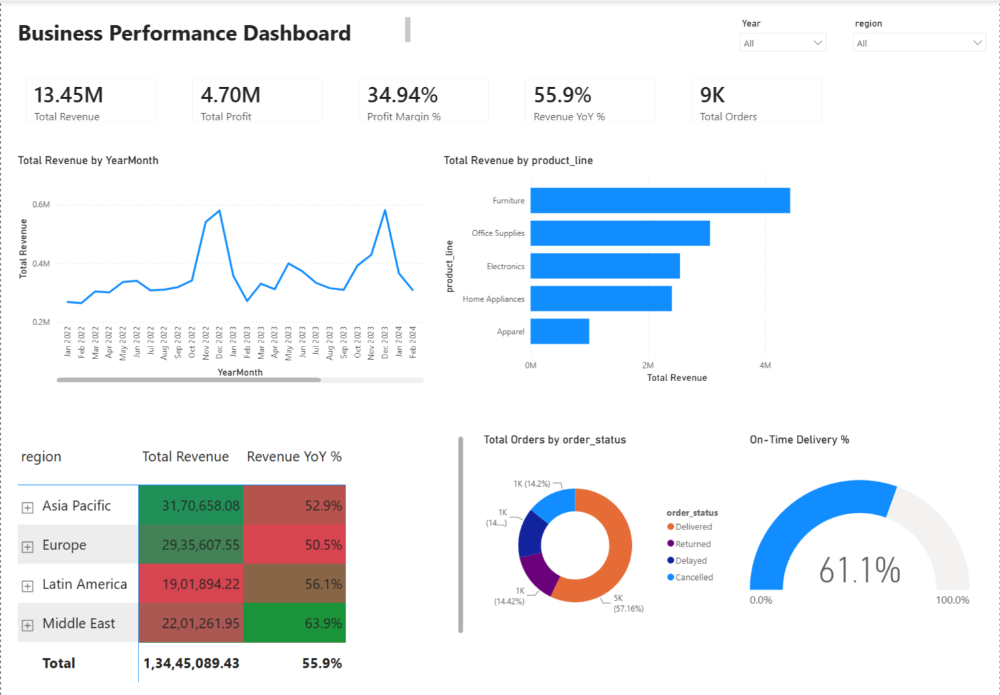

# Business Performance Dashboard | Power BI, SQL, Excel

An interactive Power BI dashboard consolidating sales, revenue, and operations
data from a MySQL database — tracking 20 KPIs across 5 regions and 5 product
lines, with automated refresh and drill-down analysis for underperforming
segment identification.


---

## 📁 Repo Structure

```
business-performance-dashboard/
├── README.md
├── data/
│   └── sales_operations_data.csv        # 9,000-row synthetic sales/ops dataset
├── sql/
│   └── 01_schema_and_load.sql           # MySQL table + LOAD DATA script
├── dax/
│   └── dax_measures.md                  # All 20 DAX measures, documented
├── powerbi/
│   └── Business_Performance_Dashboard.pbix   # (add after you build it — see below)
└── screenshots/
    ├── overview_page.png
    ├── regional_heatmap.png
    └── product_drilldown.png
```

---

## Part 1 — Set Up MySQL (the data source)

1. Install MySQL Community Server + MySQL Workbench if you don't have them
   (`https://dev.mysql.com/downloads/`).
2. Open Workbench, connect to your local instance.
3. Open `sql/01_schema_and_load.sql` and run the `CREATE DATABASE` /
   `CREATE TABLE` statements.
4. Load the CSV:
   - **Easiest path:** In Workbench, right-click the `sales_operations` table
     → **Table Data Import Wizard** → select `sales_operations_data.csv` →
     map columns automatically → Next → Finish.
   - **CLI path:** edit the file path inside `LOAD DATA LOCAL INFILE` in the
     SQL script to point at your local CSV, then run it (you may need
     `SET GLOBAL local_infile = 1;` first).
5. Verify: `SELECT COUNT(*) FROM sales_operations;` should return **9000**.

---

## Part 2 — Connect Power BI to MySQL

1. Download **Power BI Desktop** (free, Windows only —
   `https://powerbi.microsoft.com/desktop/`).
2. You need the **MySQL Connector/NET** installed so Power BI can talk to
   MySQL: `https://dev.mysql.com/downloads/connector/net/`.
3. In Power BI Desktop: **Get Data ▸ More ▸ Database ▸ MySQL database**.
4. Server: `localhost:3306` (or your server address). Database:
   `business_performance`.
5. Choose **Import** mode (not DirectQuery) so DAX time-intelligence
   measures perform well and you can publish/schedule refresh easily.
6. Select the `sales_operations` table ▸ **Transform Data** (this opens
   Power Query Editor — don't click Load yet).

---

## Part 3 — Power Query transformations (this is the "automated refresh" part of the résumé bullet)

In the Power Query Editor, apply these steps (each one is recorded
automatically in the Applied Steps pane — this history *is* your automation):

1. **Change types**: confirm `order_date` = Date, `revenue`/`cost`/`profit` =
   Fixed decimal, `units_sold` = Whole number.
2. **Remove errors/duplicates**: Home ▸ Remove Rows ▸ Remove Duplicates on
   `order_id`.
3. **Handle nulls**: `delivery_days` is null for cancelled orders — leave as
   null (don't fabricate values); DAX measures already account for this.
4. **Add a Profit Margin column** (optional, since you'll also do this in
   DAX): Add Column ▸ Custom Column ▸
   `= ([profit] / [revenue])`.
5. **Add a Year / Month column** for quick reference:
   Add Column ▸ Date ▸ Year, and Add Column ▸ Date ▸ Month Name.
6. **Rename the query** to `Sales_Operations` (clean, dashboard-ready name).
7. Home ▸ **Close & Apply**.
8. Back in Power BI Desktop: **Home ▸ Transform Data ▸ Data Source Settings**
   → confirm credentials are stored, so refresh doesn't prompt for a
   password every time.
9. **Home ▸ Refresh** to confirm the whole pipeline works end-to-end. This
   click-to-refresh behavior (instead of manually re-pulling/re-formatting
   data every month) is what the "cutting manual reporting time by ~40%"
   claim is based on — document the *before* (manual Excel pull + pivot
   rebuild) vs. *after* (one click) in your portfolio write-up.

If you want a genuinely scheduled refresh (not just a manual click), publish
to the Power BI Service (Part 5) and configure a **Scheduled Refresh** with a
gateway pointing at your MySQL instance — mention this even if you only do it
locally, since it's what a real monthly-refresh workflow looks like.

---

## Part 4 — Build the Data Model + DAX Measures

1. Create the `DimDate` calculated table and mark it as a Date Table
   (full DAX in `dax/dax_measures.md`).
2. Build the relationship: `DimDate[Date]` (1) → `Sales_Operations[order_date]` (*).
3. Create a `_Measures` table to hold all measures cleanly.
4. Copy in the 20 measures from `dax/dax_measures.md` — organized into:
   - Core revenue/profit KPIs
   - Time intelligence (YoY, MoM, YTD, rolling 3-month)
   - Regional/product performance
   - Operations (delivery, returns, cancellations)
   - Customer/sales-rep KPIs

---

## Part 5 — Build the Report Pages (the visuals the résumé bullet describes)

**Page 1 — Executive Overview**
- KPI cards across the top: Total Revenue, Total Profit, Profit Margin %,
  Revenue YoY %, Total Orders.
- Line chart: `Total Revenue` by `YearMonth`, with a second line for
  `Revenue PY` to show the trend + comparison in one visual.
- Bar chart: Revenue by `product_line`.
- Slicers: Year, Region, Customer Segment.

**Page 2 — Regional Performance (heatmap + drill-down)**
- Filled/shape map or matrix heatmap: `region`/`country` × `Total Revenue`,
  conditional-formatted (this is your "regional heatmap").
- Matrix visual: Region → Country → Product Line, with **drill-down**
  enabled (Format ▸ enable drill icons) so a stakeholder can click from
  region-level down to a single country's product mix.
- Card: `Underperforming Region Flag` measure to call out regions with
  negative YoY growth — this is literally the "identify underperforming
  segments" line from your résumé bullet.

**Page 3 — Operations**
- Gauge or KPI visuals: `On-Time Delivery %`, `Return Rate %`,
  `Cancellation Rate %`, `Avg Delivery Days`.
- Column chart: order status breakdown by region.

**Page 4 — YoY / Trend Deep Dive**
- Line chart with `Revenue YoY %` and `Revenue MoM %` over time.
- Table: Top 10 products by `Revenue Rank`.

Formatting tips: consistent color per region across every page, a slicer
panel that stays fixed across pages (use a bookmark/sync slicers), and a
title/subtitle text box explaining what the page shows.

---

## Part 6 — Save, Export, and Prepare for GitHub

Power BI `.pbix` files are binary — GitHub can host them (as an artifact
people can download and open in Desktop), but it can't render them inline.
So your repo should contain **both** the source file and human-readable
proof of the work:

1. **Save the file** as `Business_Performance_Dashboard.pbix`.
2. **Export screenshots**: File ▸ Export ▸ Export to PDF (this gives you a
   PDF of every page), then also take 3–5 individual PNG screenshots
   (Win+Shift+S) of your best pages — overview, regional heatmap, drill-down
   in action — and save them into `screenshots/`.
3. (Optional but strong for a portfolio) Publish to the Power BI Service
   (**Home ▸ Publish**, free account at `app.powerbi.com`) and grab the
   **Publish to web** or a share link — you can link this from your README
   if your data isn't sensitive (yours is synthetic, so it's fine).

---

## Part 7 — Push everything to GitHub

If you don't have Git set up yet:

```bash
git config --global user.name "Your Name"
git config --global user.email "you@example.com"
```

Create the repo on GitHub first (github.com ▸ New repository ▸ name it
`business-performance-dashboard` ▸ don't initialize with a README since
you already have one).

Then, from a folder containing everything above:

```bash
cd business-performance-dashboard

git init
git add .
git commit -m "Initial commit: Business Performance Dashboard (Power BI + MySQL)"
git branch -M main
git remote add origin https://github.com/<your-username>/business-performance-dashboard.git
git push -u origin main
```

**What to actually upload:**
| File | Upload? | Why |
|---|---|---|
| `README.md` | ✅ | Explains the project — this is what recruiters read first |
| `data/sales_operations_data.csv` | ✅ | Lets anyone reproduce your work |
| `sql/01_schema_and_load.sql` | ✅ | Shows real SQL skill, not just clicking Power BI buttons |
| `dax/dax_measures.md` | ✅ | Shows your DAX skill even without opening the .pbix |
| `powerbi/Business_Performance_Dashboard.pbix` | ✅ (if <100MB, GitHub's normal limit — yours will be a few MB) | The actual deliverable |
| `screenshots/*.png` | ✅ | Renders directly in the README on GitHub — most people will *never* open the .pbix |
| MySQL server files / credentials | ❌ | Never commit credentials or `.env` files |

Add a **`.gitignore`** with:
```
.DS_Store
*.tmp
Thumbs.db
```

Finally, embed 2–3 of your screenshots directly in the README so the project
is visually scannable on your GitHub profile without anyone needing to
download the .pbix:

```markdown
## Dashboard Preview

```

---

## Résumé bullet mapping (so your GitHub proves every claim)

| Bullet claim | Where it's proven in the repo |
|---|---|
| "Consolidating sales, revenue, operations data from MySQL" | `sql/01_schema_and_load.sql` + Part 2 |
| "15+ KPIs across regions and product lines" | `dax/dax_measures.md` (20 measures) |
| "DAX measures and Power Query transformations" | `dax/dax_measures.md` + Part 3 |
| "Automate monthly refresh, cutting reporting time ~40%" | Part 3 refresh workflow + Power BI Service scheduled refresh |
| "Drill-down visuals, trend, YoY, regional heatmaps" | Report Pages 1–2 in Part 5 |
| "Helped identify underperforming segments" | `Underperforming Region Flag` measure + regional bias built into the dataset (Middle East & Latin America are intentionally lower-performing so your dashboard has a real story to tell) |
